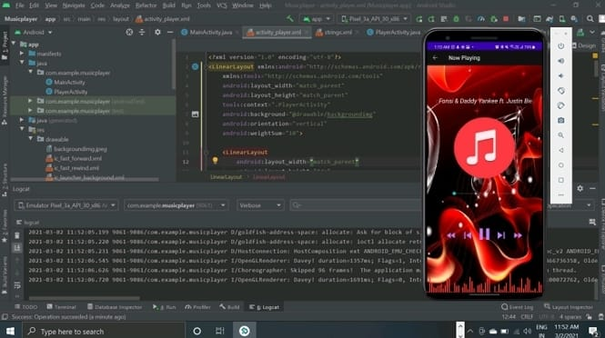

# Musicplayer
An app which gives a platform to play the audio files from your device's internal memory storage and SD card

supports .mps files and .wav files from the internal storage and SD card,
also provides audio visualizer for enchanced experience

